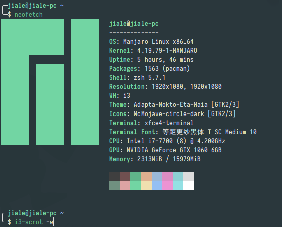

# jialeens dotfiles

this is my PC dotfiles。

**If you need help**, check out the [Support](SUPPORT.md) page.

## screenshot

### multi-display

### neofetch

### polybar 

support display on multi-display.

#### top-bar

#### bottom-bar

### rofi

### xfce4-appfinder

### conky

## Welcome to my dotfiles! 

## Supported OS

- Manjaro
- Archlinux
- Debian
- Centos
- FreeBSD

## Details

###  CLI 

- Zsh

   \- A shell designed for interactive use, although it is also a powerful scripting language. 

  - [Oh My Zsh](https://github.com/robbyrussell/oh-my-zsh) - An open source, community-driven framework for managing your Zsh configuration.

- [Bash](https://git.savannah.gnu.org/cgit/bash.git) - A Unix shell and command language.

- [ranger](https://github.com/ranger/ranger) - A VIM-inspired filemanager for the console.
- [i3-scrot](https://github.com/pazuzu156/i3scrot) - Shell script for taking screenshots with scrot.
- [MPD](https://github.com/MusicPlayerDaemon/MPD) - A daemon for playing music of various formats.
- [MPC](https://github.com/MusicPlayerDaemon/mpc) - Command-line client for MPD.
###  GUI 
- [i3](https://github.com/i3/i3) - A tiling window manager.
- [Polybar](https://github.com/polybar/polybar) - A fast and easy-to-use status bar.
- [i3lock-fancy](https://github.com/meskarune/i3lock-fancy) - A script that takes a screenshot of the desktop, blurs the background and adds a lock icon and text.
- [Rofi](https://github.com/davatorium/rofi) - A window switcher, application launcher and dmenu replacement.
- [Dunst](https://github.com/dunst-project/dunst) - A highly configurable and lightweight notification daemon.
- [Conky](https://github.com/brndnmtthws/conky) - Light-weight system monitor for X.
- [xfce4-terminal](https://github.com/xfce-mirror/xfce4-terminal) - Xfce Terminal is a lightweight and easy to use terminal emulator application
  with many advanced features including drop down, tabs, unlimited scrolling,
  full colors, fonts, transparent backgrounds, and more.
- [xfce4-appfinder]() - Application launcher and finder
- [deepin-system-monitor](https://github.com/linuxdeepin/deepin-system-monitor) - System monitor for DDE.
- [Compton](https://github.com/yshui/compton) - A compositor for X11.
- [Adapta-Nokto-Eta-Maia](https://github.com/adapta-project/adapta-gtk-theme) - A dark theme based on Material Design Guidelines. Cinnamon, Metacity, GTK2, GTK3.18 and GTK3.22+ themes are included..
- [McMojave-circle-dark](https://github.com/vinceliuice/Tela-icon-theme) - McMojave-circle icon theme 
- [Feh](https://feh.finalrewind.org/) - a fast and light image viewer
- [redshift](https://github.com/jonls/redshift) - Redshift adjusts the  color temperature of your screen according to your surroundings. This  may help your eyes hurt less if you are working in front of the screen  at night.
### Fonts
- Font Awesome 5 Free
- Font Awesome 5 Brands
- Weather Icons
- Sarasa Term SC
- DejaVuSansMono Nerd Font

## License

[Apache License 2.0](http://www.apache.org/licenses/LICENSE-2.0)
